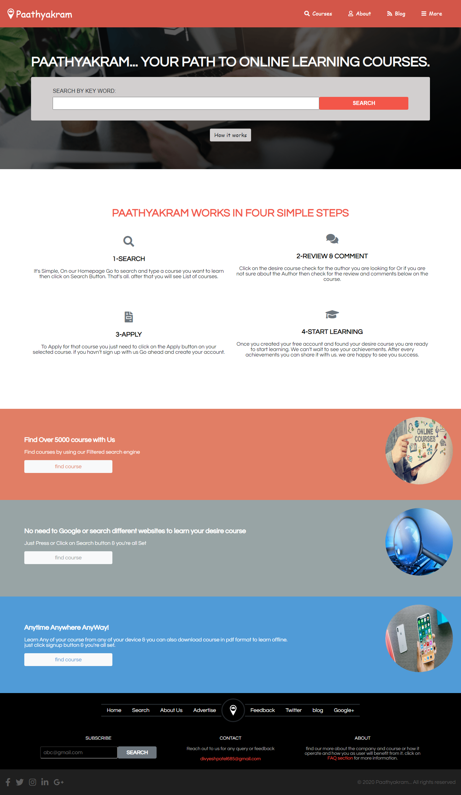

# HTML-CSS-Capstone Directory of Online Course

This is HTML-CSS-Capstone project built to search for online courses.



## About The Project

This is the HTML-CSS-Capstone Project. Main goal for this project was to build Directory of online courses by using Given design.
It contains Three pages

- Main Page.
- Search Page to search for courses.
- Detail Page to know the Details about that course.

## Built With

- HTML
- CSS
- Bootstrap 4
- Fontawesome

## Live Demo

[Live Demo Link](https://awesome-jang-809c28.netlify.app/index.html)

## Getting Started

- To get a local copy up and running follow these simple steps.

- clone This repository by using following command in your local PC:

```
git clone https://github.com/Div685/HTML-CSS-Capstone.git

```
- Run index.html file on a browser.


## Author

👤 **Divyesh Patel**

- GitHub: [@Div685](https://github.com/Div685)
- Twitter: [@div_685](https://twitter.com/div_685)
- LinkedIn: [Divyesh Patel](https://www.linkedin.com/in/divyesh-daxa-patel)

## 🤝 Contributing

Contributions, issues, and feature requests are welcome!

Feel free to check the [issues page](https://github.com/Div685/HTML-CSS-Capstone/issues).

## Show your support

Give a ⭐️ if you like this project!

## Acknowledgements

- I would like to thank [Mathew Njuguna](https://www.behance.net/mathewnjuguna) for providing such a wonderfull design. you can check our his other Designs on [Behance](https://www.behance.net/mathewnjuguna).

- Mathew Njuguna's design can be found [Here](https://www.behance.net/gallery/25563385/PatashuleKE) for this Project.
